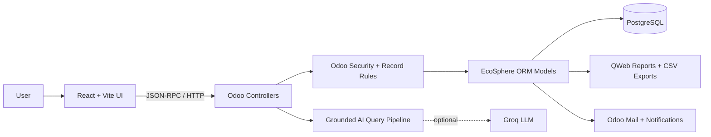

<div align="center">

# 🌿 EcoSphere

### All impact. One signal.

**A connected ESG operating system for carbon, people, governance, reporting, and employee action.**

[](https://www.odoo.com/)
[](https://react.dev/)
[](https://www.postgresql.org/)
[](https://gsap.com/)
[](backend/__manifest__.py)

<br />


<br />

[Explore features](#-what-ecosphere-does) · [Run locally](#-run-it-locally) · [Architecture](#-architecture) · [Testing](#-testing)

</div>

---

## The idea

ESG work is usually scattered across spreadsheets, inboxes, policy folders, and disconnected reporting tools. EcoSphere brings it into one operational workspace where every metric stays connected to its owner, evidence, workflow, and next action.

It combines an immersive React experience with an Odoo-native business engine, so sustainability teams get a polished interface without losing the access control, auditability, and transactional reliability of an ERP.

> **Evidence in. Confidence out.**

## ✦ What EcoSphere does

| Pillar | Capabilities |
|---|---|
| 🌱 **Environmental** | Emission factors, Scope 1–3 carbon transactions, product ESG profiles, department rollups, environmental goals, and progress tracking |
| 🤝 **Social** | CSR programmes, employee participation, evidence review, diversity indicators, training metrics, and departmental visibility |
| 🛡️ **Governance** | Policies, acknowledgements, audits, issue ownership, due dates, overdue detection, and resolution workflows |
| ⚡ **Gamification** | Playable challenges, verified submissions, XP, badges, rewards, participation review, and leaderboards |
| 📊 **Intelligence** | Weighted ESG scoring, organisation dashboards, standard reports, filtered exports, and grounded EcoSphere AI answers |
| 🔐 **Administration** | Role-aware access, team provisioning, workspace configuration, Google OAuth, notification controls, and Odoo security rules |

## ✨ Product experience

- A GSAP-powered Awwwards-inspired landing page with pinned storytelling, clip-path reveals, and scroll choreography.
- An animated sign-in experience with floating ESG signal capsules and responsive visual depth.
- Separate administrator and employee journeys with role-specific actions and data visibility.
- Connected workspaces for environmental, social, governance, reporting, and gamification operations.
- A grounded AI assistant that answers from authorised EcoSphere data and returns citations instead of inventing metrics.
- Responsive layouts with reduced-motion support and mobile-specific background simplification.

## 🧭 Architecture



### Technology stack

| Layer | Technology | Responsibility |
|---|---|---|
| Experience | React, Vite, Framer Motion, GSAP | Landing page, authentication, dashboards, modules, and interaction design |
| API | Odoo HTTP and JSON-RPC controllers | Authenticated frontend access and workflow actions |
| Domain | Python, Odoo 18 ORM | ESG rules, scoring, approvals, evidence, reporting, and access control |
| Data | PostgreSQL 16 | Relational ESG records and transactional state |
| Delivery | Docker, Nginx, Render | Local parity and production deployment |

## 🗂 Repository map

```text
ECOSHPHERE/
├── frontend/                 # React/Vite experience
│   ├── public/images/        # Original EcoSphere visual assets
│   └── src/
│       ├── App.jsx           # Authentication + application workspaces
│       ├── LandingPage.jsx   # Animated marketing experience
│       ├── LandingPage.css   # Landing motion and responsive styling
│       ├── api.js            # Odoo client and session handling
│       └── styles.css        # Product UI system
├── backend/                  # Installable Odoo addon
│   ├── controllers/          # HTTP/JSON-RPC endpoints
│   ├── models/               # ESG business domain and scoring
│   ├── services/             # Grounded AI query pipeline
│   ├── reports/              # Environmental, social, governance, summary
│   ├── security/             # Groups, ACLs, and record rules
│   ├── tests/                # Odoo transaction tests
│   ├── views/                # Native Odoo administration views
│   └── docker-compose.yml    # Odoo 18 + PostgreSQL 16
├── context/                  # Product and engineering decisions
├── deploy/render/            # Production Nginx/runtime configuration
├── Dockerfile
└── render.yaml
```

## 🚀 Run it locally

### Prerequisites

- [Docker Desktop](https://www.docker.com/products/docker-desktop/)
- Node.js 20 or newer
- npm

### 1. Clone the project

```bash
git clone https://github.com/amartya1523/ECOSHPHERE.git
cd ECOSHPHERE
```

### 2. Configure and start Odoo

```bash
cp backend/.env.example backend/.env
```

Open `backend/.env` and replace the placeholder PostgreSQL password. Optional Google OAuth and Groq credentials also belong in this file—never in frontend code.

```bash
cd backend
docker compose up -d
```

Odoo becomes available at [http://localhost:8069](http://localhost:8069). The startup script creates the local database and installs/updates the EcoSphere addon.

### 3. Start the React frontend

In a second terminal:

```bash
cd frontend
npm install
npm run dev
```

Open [http://localhost:5173](http://localhost:5173). Vite proxies `/odoo` and `/auth_oauth` requests to the local Odoo server.

### Local demo accounts

| Role | Email | Password |
|---|---|---|
| Administrator | `admin@ecosphere.local` | `Admin@EcoSphere2026` |
| Employee | `employee@ecosphere.local` | `Employee@EcoSphere2026` |

> Demo credentials are seeded for local development only. Replace or disable them before exposing an environment publicly.

## 🧪 Testing

### Frontend production build

```bash
cd frontend
npm run build
```

### Odoo test suite

```bash
cd backend
docker compose exec odoo odoo \
  -d ecosphere_test \
  --db_host=db \
  --db_user=odoo \
  --db_password="$POSTGRES_PASSWORD" \
  --addons-path=/usr/lib/python3/dist-packages/odoo/addons,/mnt/extra-addons \
  -i eco_sphere_esg \
  --test-enable \
  --test-tags /eco_sphere_esg \
  --stop-after-init \
  --no-http \
  --http-port=8071 \
  --without-demo=all
```

The backend suite covers core setup, carbon calculations, CSR evidence, policy acknowledgements, audits, compliance deadlines, challenge lifecycles, rewards, scoring, reports, exports, and the grounded AI pipeline.

## ⚙️ Useful commands

```bash
# Follow backend logs
cd backend && docker compose logs -f odoo

# Restart Odoo after Python or XML changes
cd backend && docker compose restart odoo

# Stop containers while preserving PostgreSQL data
cd backend && docker compose down

# Preview the frontend production build
cd frontend && npm run preview
```

Do not run `docker compose down -v` unless you intentionally want to remove the local database volume.

## ☁️ Deployment

The repository includes a root `Dockerfile`, Render infrastructure in `render.yaml`, and an Nginx configuration that serves the frontend while proxying Odoo routes. Production secrets such as `DATABASE_URL`, `GOOGLE_OAUTH_CLIENT_ID`, and `GROQ_API_KEY` must be configured through the hosting provider.

## 🔒 Security notes

- Secrets and local `.env` files are ignored by Git.
- API operations use authenticated Odoo sessions and server-side access checks.
- Record rules scope employee data; privileged actions remain administrator-only.
- AI queries are filtered through an allowlisted, access-aware pipeline.
- Final ESG disclosures remain subject to each organisation's reporting scope, controls, and assurance process.

## 📚 Project context

Product and engineering decisions live in [`context/`](context/):

- [`PRD.md`](context/PRD.md) — product requirements and success criteria
- [`Architecture.md`](context/Architecture.md) — system design and technical decisions
- [`Design.md`](context/Design.md) — interface direction and visual principles
- [`Rules.md`](context/Rules.md) — implementation constraints
- [`Phases.md`](context/Phases.md) — delivery sequence
- [`Memory.md`](context/Memory.md) — durable project decisions

---

<div align="center">

**Built for accountable business. Designed to make progress visible.**

`MEASURE → CONNECT → ACT → REPORT`

</div>
